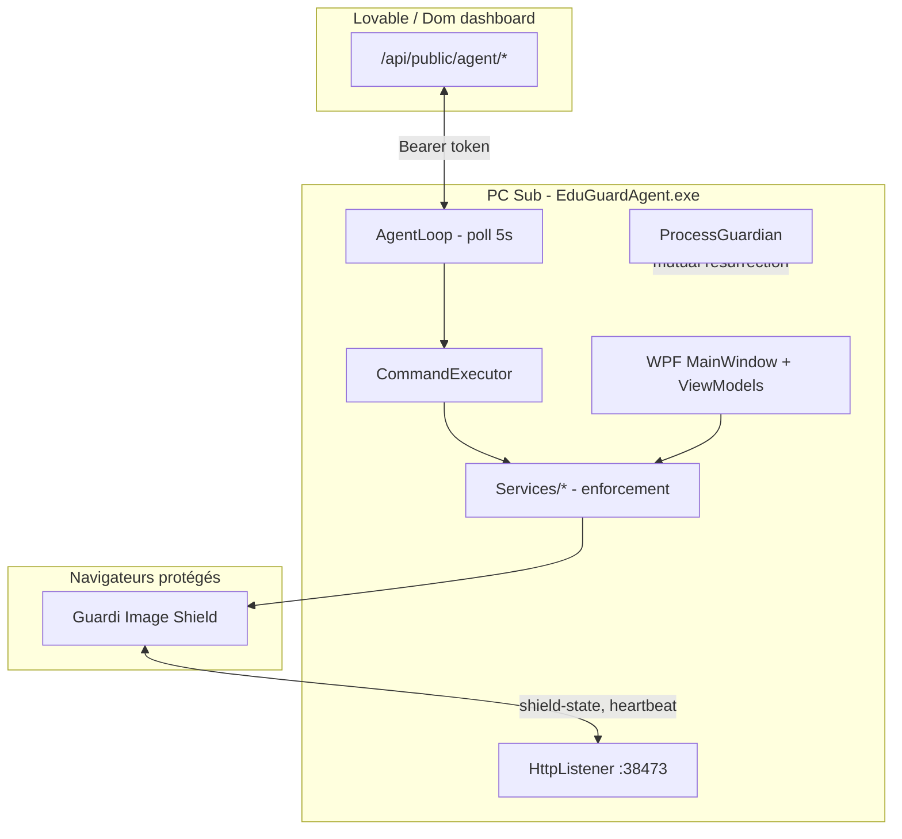

# AGENTS.md - EduGuard / Guardi (Windows Agent)

Guide pour les agents de code (Codex, Cursor, etc.) qui travaillent sur ce dépôt.

## 1. Qu'est-ce que ce projet ?

**EduGuard** (marque utilisateur : **Guardi**) est un agent de supervision Windows installé sur le PC de la personne supervisée. Le projet est destiné à un usage consenti et explicite entre adultes, avec une esthétique et un vocabulaire Dom/Sub.

Le Sub voit une application WPF plein écran (dashboard Guardi) qui affiche ses règles, son temps d'écran, ses restrictions, etc. En arrière-plan, l'agent :

- dialogue avec le serveur (enrollment, heartbeat, commandes distantes) ;
- applique des règles locales (blocage sites/apps, temps de jeu/YouTube, coucher, mode kiosk, punitions) ;
- force-installe et surveille une extension navigateur Guardi Image Shield (floutage NSFW on-device) ;
- se protège contre la fermeture (watchdog, verrous système selon le mode).

Principe clé : le PC du Sub est la source d'exécution ; le cloud Lovable est la source de vérité des réglages, sauf en **mode local**.

Toute fonctionnalité de sécurité doit rester consentie, explicite, auditée et réversible. Ne pas ajouter de furtivité, d'évasion antivirus, de dissimulation, de persistance irréversible ou de mécanisme empêchant toute sortie autorisée.

## 2. Vocabulaire

| Terme | Signification |
| --- | --- |
| **Dom** | Superviseur / personne qui pilote les règles depuis le dashboard web |
| **Sub** | Personne supervisée sur le PC Windows |
| **Guardi** | Nom produit côté Sub (UI, extension, mascotte) |
| **Agent** | Processus `EduGuardAgent.exe` + services associés |
| **Mode** | Niveau de supervision : `trusted_sub`, `sub`, `restricted_sub` |
| **Image Shield** | Extension navigateur qui floute localement les images NSFW |
| **Extension guard** | Boucle qui vérifie présence/version de l'extension et réinstalle si besoin |
| **Local mode** | Mode hors-ligne : ignore heartbeat/commandes distantes, règles dans AppData |

## 3. Architecture



Flux typique :

1. Enrollment : code 8 caractères -> `POST /register` -> token DPAPI dans `%AppData%\EduGuard\agent.dat`.
2. Boucle agent (`AgentLoop`, intervalle `Config.LoopIntervalMs` = 5 s) : heartbeat, poll commandes, applique règles.
3. Commandes Dom : `block_url`, `set_mode`, `lock_screen`, `set_image_shield`, etc. -> `CommandExecutor`.
4. Extension : lit `http://127.0.0.1:38473/shield-state` + `chrome.storage.managed`, floute les ``, envoie heartbeats / infractions.
5. Fermeture agent : désactive le filtrage runtime (`shieldActive: false`) ; le watchdog peut relancer l'agent si kill non autorisé.

## 4. Structure du dépôt

```text
EduGuardAgent/
|-- Program.cs              # Point d'entrée (UI, watchdog, native messaging)
|-- App.xaml(.cs)           # Bootstrap WPF, ProcessGuardian, release extension lock
|-- MainWindow.xaml(.cs)    # Shell UI principale (dashboard Sub)
|-- Config.cs               # Constantes prod (URLs extension, ports, flags)
|-- Config.Build.cs         # Switches Debug vs Release (partial class Config)
|
|-- Agent/                  # Client HTTP Lovable (ApiClient, AgentLoop, AgentHost)
|-- Commands/               # CommandExecutor - exécution commandes Dom
|-- Models/                 # DTOs, modes, punitions, payloads JSON
|-- Profiles/               # Textes UI, thèmes, registre des 3 modes
|-- ViewModels/             # MainViewModel (partial) - orchestration UI + IAgentNotifier
|-- Views/                  # UserControls WPF (settings, toasts, lock overlay, mascotte)
|-- Services/               # Logique métier (blocage, temps, extension, kiosk, etc.)
|-- Security/               # Token DPAPI, audit, ProcessGuardian, endpoint resolver
|-- Converters/             # Converters XAML
|
|-- extension/              # Guardi Image Shield (JS, Chromium + Firefox)
|   |-- src/                # Content scripts, inference, heartbeat, search guard
|   |-- public/             # manifest.base.json, HTML, assets
|   |-- scripts/            # build, sign Firefox, publish GitHub/AMO
|   `-- store-config.json   # IDs store + version extension (copié en Release)
|
`-- docs/                   # Specs intégration Lovable, protocole agent, extension
```

## 5. Stack technique

| Couche | Technologie |
| --- | --- |
| Agent desktop | .NET 9, WPF, Windows only (`[SupportedOSPlatform("windows")]`) |
| HTTP serveur | `HttpListener` + ASP.NET Core Kestrel (page de blocage HTTPS) |
| Extension | esbuild, TensorFlow.js / modèle NSFW on-device |
| Navigateurs | Chrome, Edge, Brave (Chromium policies) ; Firefox (`policies.json` + XPI) |
| Backend Dom | Lovable app (`*.lovable.app`) - pas dans ce repo |
| Données locales | `%AppData%\EduGuard\` (JSON + secrets chiffrés DPAPI) |

## 6. Les trois modes de supervision

Définis dans `Profiles/AgentModeRegistry.cs` et `Models/AgentMode.cs`.

| Slug | Nom | Strictesse | Résumé |
| --- | --- | --- | --- |
| `trusted_sub` | Trusted Sub | 0 (le plus permissif) | Ton étude, Task Manager autorisé |
| `sub` | Sub | 1 | Supervision standard Guardi |
| `restricted_sub` | Restricted Sub | 2 | Verrouillage maximal, kiosk prévu |

Chaque mode a : thème UI (`ModeTheme`), textes (`ModeCopy`), features (`ModeFeatures` : Task Manager, VPN shield, kiosk, etc.), defaults temps d'écran/jeu/coucher.

Le slug actif est envoyé au serveur dans le champ `level` du heartbeat.

## 7. Sous-systèmes importants

### 7.1 Agent HTTP (Dom <-> PC)

- Spec : `docs/AGENT_PROTOCOL.md`
- Client : `Agent/ApiClient.cs`, boucle : `Agent/AgentLoop.cs`
- Capabilities : `Agent/AgentCapabilityRegistry.cs`
- Endpoint : `Security/AgentEndpointResolver.cs`
- Debug -> URL `-dev.lovable.app`
- Release -> URL prod, avec override possible via `EDUGUARD_BASE_URL` ou `endpoint.json` avec garde-fous

### 7.2 Blocage web / apps

- URLs : `Services/UrlBlockingService.cs` - fichier `hosts` + serveur page HTTPS (`BlockPageServer`)
- Apps : liste locale + kill à chaque poll
- VPN : `VpnBlockingService`
- Safe Search / YouTube Restricted : policies Chromium + Firefox

### 7.3 Temps et verrous

- Screen time : `ScreenTimeTracker` -> overlay `LockOverlayWindow`
- Gaming / YouTube : trackers + toasts ; YouTube ferme la fenêtre navigateur, pas tout le processus
- Bedtime : `BedtimeService` - verrou nocturne + réveil auto
- Study time : `StudyDistractionGuard` - ferme apps de distraction pendant créneaux

### 7.4 Punitions / discipline

- Escalade de mode sur infractions extension / comportement
- Service : `Services/PunishmentService.cs`
- Spec : `docs/LOVABLE_PUNISHMENT_INTEGRATION.md`

### 7.5 Guardi Image Shield

- Service principal : `Services/ImageBlurExtensionService.cs`
- Policies Chromium : `ChromiumExtensionPolicy.cs` (`ExtensionInstallForcelist`)
- Policies Firefox : `FirefoxExtensionPolicy.cs` (`policies.json`, `install_url` file:// ou GitHub)
- Runtime on/off : `ImageShieldRuntimeStore`, `SetRuntimeActive(true|false)`
- Important : à la fermeture de Guardi, `shieldActive` passe à `false` ; au redémarrage, `MainViewModel` doit resynchroniser si supervision active

### 7.6 Extension guard

- `Services/ExtensionEnforcementService.cs` - boucle toutes les `ExtensionGuardTickMs`
- Détecte extension absente / version basse / navigateur non supporté
- Redémarrage navigateur doux : countdown + `--restore-last-session` (`BrowserSoftRestartEnabled`)

### 7.7 HTTP local (extension <-> agent)

Port `38473` (`ExtensionInfractionHttpReporter`) :

| Route | Rôle |
| --- | --- |
| `GET /shield-state` | `{ active, managed: { shieldActive, ... } }` - extension décide si filtrage actif |
| `POST /extension-heartbeat` | Preuve de vie extension |
| `POST /blocked-search` | Infraction recherche bloquée |

### 7.8 Sécurité / résilience

- `ProcessGuardian` : double processus `--watchdog` / agent, résurrection mutuelle
- `ProcessSelfProtection` : DACL processus
- Token : DPAPI `TokenStorage`
- Audit : `%AppData%\EduGuard\audit.log` (rotation 5 Mo)
- Admin requis pour : hosts, policies extension, certificat HTTPS blocage

### 7.9 Mode local

- `Services/LocalModeService.cs` - ignore cloud quand activé
- UI : `Views/LocalSettingsPanel.xaml` - édition règles par mode dans AppData
- Sync optionnelle vers serveur quand désactivé

### 7.10 UI WPF

- `MainViewModel` (partials : `TodayRules`, `LocalDashboard`, `AutoStart`) est gros : préférer extraire en services ou ajouter un partial ciblé
- Thèmes : `Services/ThemeService.cs` + `Profiles/ModeTheme.cs`
- Style récent : Deep Glass (gradient, cartes verre) sur `MainWindow.xaml`
- Textes utilisateur : `Profiles/UiCopy.cs`, `ModeCopy`, `LocalModeCopy` - ne pas hardcoder des strings Sub-facing ailleurs

## 8. Extension navigateur

- ID Chromium : `pooilkajkfmogajdafmaphmjecofpbbk` (Chrome Web Store)
- ID Firefox : `image-shield@guardi.app`
- Version courante : `extension/store-config.json` (ex. `0.8.7`)
- Chromium : inference dans offscreen document
- Firefox : inference dans background script (pas d'offscreen API)
- Pas de `chrome_url_overrides.newtab` permanent : redirection newtab uniquement quand supervision active
- Docs : `extension/README.md`, `docs/EXTENSION_STORE_PUBLISHING.md`, `docs/EXTENSION_LOCAL_TEST.md`

Commandes :

```powershell
cd extension
npm install
npm run build
npm run build:firefox
```

Fichiers JS clés :

| Fichier | Rôle |
| --- | --- |
| `src/active-state.js` | Lit shield-state HTTP + managed storage |
| `src/inference.js` | Modèle NSFW, blur/unblur |
| `src/heartbeat.js` | Ping agent |
| `src/search-guard.js` | Blocage termes recherche |
| `src/guardi-chrome.js` | Injection UI Chrome |

## 9. Debug vs Release

`Config.Build.cs` (partial `Config`) :

| Élément | Debug | Release |
| --- | --- | --- |
| `ExtensionGuardDevBypass` | `true` | `false` compilé |
| `ExtensionGuardFirefoxLocalMode` | mutable | `false` |
| `ExtensionGuardChromiumUnpackedMode` | mutable | `false` |
| Endpoint Lovable | `-dev` | prod |
| `EDUGUARD_NO_GUARD` | respecté | ignoré |
| `TestingShort*` timers | forcés `false` en Release | forcés `false` en Release |

Ne jamais activer de bypass sécurité en Release sans demande explicite.

## 10. Build et exécution

```powershell
# Agent (admin recommandé : hosts, policies extension)
cd C:\Users\vferr\Projects\EduGuardAgent
dotnet build -c Release

# Lancer en administrateur :
.\bin\Release\net9.0-windows\EduGuardAgent.exe

# Dev
dotnet run
```

Release : `extension/store-config.json` est copié à côté de l'exe (`EduGuardAgent.csproj`).

Tests extension locaux : `docs/EXTENSION_LOCAL_TEST.md` (`npm run pack:host` + `serve:host`).

## 11. Fichiers et données locales

| Chemin | Contenu |
| --- | --- |
| `%AppData%\EduGuard\agent.dat` | Token agent (DPAPI) |
| `%AppData%\EduGuard\exit_pin.dat` | PIN de sortie (DPAPI) |
| `%AppData%\EduGuard\blocked_hosts.json` | Sites bloqués |
| `%AppData%\EduGuard\audit.log` | Journal sécurité |
| `%AppData%\EduGuard\endpoint.json` | Override URL (staging) |
| `%AppData%\EduGuard\firefox-xpi-cache\` | Cache XPI Firefox signé |

Ne jamais afficher, copier dans le chat ou supprimer les secrets `.dat` sans demande explicite.

## 12. Conventions de code

### C# / WPF

- Namespace racine : `EduGuardAgent`
- Services : `internal sealed class XxxService` dans `Services/`
- Plateforme Windows : annoter `[SupportedOSPlatform("windows")]` quand APIs Win32
- `Config` est une classe partial : constantes dans `Config.cs`, flags build dans `Config.Build.cs`
- `MainViewModel` est une classe partial : ajouter un fichier `MainViewModel.Xxx.cs` plutôt que gonfler le fichier principal
- UI bindings : `INotifyPropertyChanged`, commandes via patterns existants dans `MainViewModel`
- Erreurs sensibles : `AuditLog.Write(...)` en plus des messages UI
- Minimal diff : ne pas refactoriser hors scope ; matcher le style existant (nullable, implicit usings)

### Extension JS

- ESM, build esbuild (`extension/esbuild.config.mjs`)
- Defaults tuning : `src/shared.js`
- Ne pas envoyer d'images au serveur : tout reste on-device

### XAML

- Ressources globales : `App.xaml` (brushes, styles `GlassCard`, boutons)
- Thème dynamique par mode : `ThemeService.Apply(ModeTheme)`
- Textes : bindings vers ViewModel ou `{x:Static prof:UiCopy....}`

## 13. Commandes Dom supportées

Voir `Commands/CommandExecutor.cs` pour la liste à jour :

`show_message`, `lock_screen`, `unlock_screen`, `kill_process`, `block_app`, `unblock_app`, `block_url`, `unblock_url`, `set_bedtime`, `set_exit_pin`, `set_gaming_limit`, `set_gaming_games`, `set_gaming_overlay`, `set_youtube_limit`, `set_youtube_overlay`, `set_youtube_restricted_mode`, `set_study_time`, `set_mode`, `set_kiosk_apps`, `set_punishment`, `reset_punishment`, `set_image_shield`, etc.

Nouvelle commande = handler dans `CommandExecutor` + entrée `AgentCapabilityRegistry` + doc Lovable si API serveur change.

## 14. Pièges connus

1. Extension installée mais inactive : au shutdown, `SetRuntimeActive(false)` ; au startup, vérifier resync dans `MainViewModel` / `ReconcileImageShieldCore` si `shouldRun && (!runtimeOn || !policiesOn)`.
2. Firefox + proxy : `install_url` GitHub peut échouer ; Release préfère `file:///.../distribution/extensions/*.xpi` via `ApplyBundledSignedPolicies()`.
3. Release + store-config : version embarquée doit correspondre au XPI publié, sinon 404 policy.
4. Admin : sans élévation, policies extension et hosts échouent silencieusement ou avec message audit.
5. ProcessGuardian : ne pas casser les args `--watchdog`, `--spawn-*`, `EDUGUARD_NO_GUARD` (Debug only).
6. YouTube : fermer fenêtre/tab, pas `Kill()` sur tout `firefox.exe` / `chrome.exe`.
7. UI Glass Cursor != chat Codex ; hors scope de ce repo.
8. CA locale : toute installation de certificat doit avoir un chemin de nettoyage/retrait clair.
9. Bridge HTTP local : garder les routes minimales, éviter d'exposer des secrets, journaliser les anomalies.

## 15. Documentation complémentaire

| Document | Sujet |
| --- | --- |
| `docs/AGENT_PROTOCOL.md` | Protocole HTTP agent <-> Lovable |
| `docs/LOVABLE_MODE_INTEGRATION.md` | Modes supervision côté Dom |
| `docs/LOVABLE_IMAGE_SHIELD_INTEGRATION.md` | Image shield + commandes Dom |
| `docs/LOVABLE_PUNISHMENT_INTEGRATION.md` | Discipline / escalade |
| `docs/LOVABLE_YOUTUBE_INTEGRATION.md` | Limites YouTube |
| `docs/LOVABLE_STUDY_TIME_INTEGRATION.md` | Heures d'étude |
| `docs/EXTENSION_STORE_PUBLISHING.md` | Publication Chrome + Firefox AMO |
| `docs/EXTENSION_LOCAL_TEST.md` | Test extension sans store |
| `README.md` | Quick start blocage sites (partiel, pas à jour sur toute la surface) |

## 16. Checklist avant PR / commit

- [ ] `dotnet build -c Release` sans erreur
- [ ] Si extension modifiée : `npm run build` dans `extension/` + bump `store-config.json` si release
- [ ] Pas de secrets (`.amo-credentials`, tokens, fichiers `.dat`) dans le commit
- [ ] Changements sécurité : vérifier Debug vs Release dans `Config.Build.cs`
- [ ] Textes Sub visibles : passent par `Profiles/*Copy*.cs` ou ressources XAML
- [ ] Admin-only : message clair dans UI ou audit si échec
- [ ] Toute fonctionnalité de verrouillage garde un chemin de sortie autorisé

## 17. Objectif produit

Le Sub utilise son PC dans une bulle Guardi : règles visibles, ton adapté au mode, navigateur protégé (images + recherche + temps), fermeture de l'agent rendue difficile sans autorisation, et le Dom garde le contrôle à distance via Lovable, sauf mode local explicite.

Quand tu hésites sur une implémentation, demande-toi : est-ce que ce changement rend Guardi plus facile à contourner sans autorisation, ou plus difficile à quitter de façon consentie et prévue ? Dans les deux cas, réexaminer le design avant de coder.
